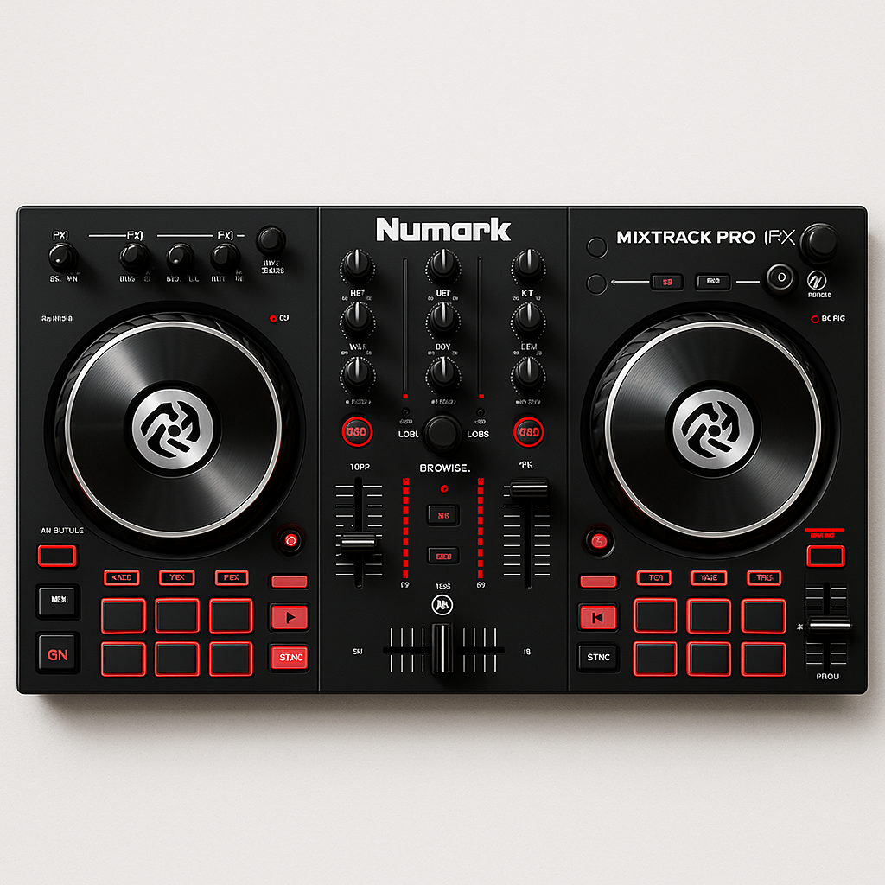

# 🎛️ Numark Mixtrack Pro FX - Mixxx 2.5.0 Mapping

This project contains a **complete custom mapping** for the **Numark Mixtrack Pro FX** DJ controller to work with the **Mixxx 2.5.0** DJ software on **Windows 10**.

## 🎯 Project Goal
Create a fully working controller mapping to enable all features of the Mixtrack Pro FX for Mixxx users, and provide a community-ready open-source mapping.

## 🎚️ Mapped Functions
- Channel 1 & 2 Volume Faders
- Crossfader
- EQ (High, Mid, Low)
- Gain Knobs
- Jog Wheels (Scratch & Pitch Bend)
- Play / Cue Buttons
- FX Toggle Buttons
- FX Select / FX Level Knobs
- Loop In / Out
- Auto Loop Controls
- Sync Buttons
- Pitch Faders
- Load Deck A / B Buttons
- Browse Knob + Load Controls
- Pad Mode (Hot Cue / Loop Roll / Sampler / Cue Loop)
- Sampler Pads
- Shift Function

## 🌟 Features
- Full controller integration including:
    - 🎚️ Channel faders & crossfader
    - 🔊 EQ controls (High/Mid/Low)
    - 🎛️ Filter knobs
    - ▶️ Transport controls (Play/Cue/Sync)
    - 🎧 Headphone cueing
    - 🔄 Jog wheels with scratch functionality
    - 💡 Performance pads (Hotcues, Loop, Roll)

## 🧠 Tech Stack
- Mixxx 2.5.0 (official release)
- Windows 10 x86_64
- Mapping written in JavaScript + XML (Mixxx Controller Mapping Format)
- Git for version control
- IntelliJ Ultimate for editing

## 📁 File Structure

- `mixtrack-pro-fx-mapping/`
- `MixtrackProFX-scripts.js`
- `MixtrackProFX.xml`
- `README.md`

## 🤝 Contributions
Pull requests welcome! - If you own a Mixtrack Pro FX and want to improve or adapt the mapping — feel free to fork and submit a PR!

## 🌍 License
MIT – Free to use, modify, and share.

## 💬 Contact
Project by Nini — part of a creative mixtape project for Tomorrowland 🎵  
GitHub: Usamoto 
